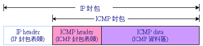
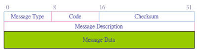

# ICMP封包結構
```
報頭
ICMP報頭從IP報頭的第160位元開始（IP首部20位元組）（除非使用了IP報頭的可選部分）。

Bits |	160-167	| 168-175	| 176-183 |	184-191
160	 |  Type	  | Code	  | 校驗碼  |（checksum）
192	 |         ID	        | 序號    |（sequence）

Type - ICMP的類型,標識生成的錯誤封包；
Code - 進一步劃分ICMP的類型,該欄位用來尋找產生錯誤的原因.；例如，ICMP的目標不可達類型可以把這個位設為1至15等來表示不同的意思。
Checksum - 校驗碼部分,這個欄位包含有從ICMP報頭和資料部分計算得來的，用於檢查錯誤的資料，其中此校驗碼欄位的值視為0。
ID - 這個欄位包含了ID值，在Echo Reply類型的訊息中要返回這個欄位。
Sequence - 這個欄位包含一個序號，同樣要在Echo Reply類型的訊息中要返回這個欄位。


填充資料
填充的資料緊接在ICMP報頭的後面（以8位元為一組）：
Linux的"ping"工具填充的ICMP除了8個8位元組的報頭以外，預設情況下還另外填充資料使得總大小為64位元組。
Windows的"ping.exe"填充的ICMP除了8個8位元組的報頭以外，預設情況下還另外填充資料使得總大小為40位元組。
```
```
https://zh.wikipedia.org/wiki/%E4%BA%92%E8%81%94%E7%BD%91%E6%8E%A7%E5%88%B6%E6%B6%88%E6%81%AF%E5%8D%8F%E8%AE%AE
```
#### ICMP Message Format封包格式:



# ICMP 封包格式，其各欄位功能如下：
```

(1) 訊息型態（Message Type）：表示該 ICMP 所欲控制之訊息型態，共有 13 種型態，訊息型態之型態代表值如下表Message Type所示。

(2) 編碼（Code）：對各種訊息型態進一步說明工作內容。

(3) 檢查集檢查碼（Checksum）：對該封包檢查集錯誤偵測。

(4) 訊息說明（Message description）：依照不同的控制訊息，而有不同的說明方式。

(5) 訊息資料（Message Data）：依照不同的控制訊息，而有不同的資料表示。
```
```
Message Type

ICMP 訊息功能

0  |  Echo Reply（回應答覆）

3  |  Destination Unreachable（目的地無法到達）

4  |  Source Quench（來源抑制）

5  |  Redirect（改變傳輸路徑）

8  |  Echo Request（回應要求）

11  |  Time Exceeded for a Datagram（溢時傳輸）

12  |  Parameter Problem on a Datagram（參數問題）

13  |  Timestamp Request（時間標籤要求）

14  |  Timestamp Reply（時間標籤回覆）

15  |  Information Request（資訊要求）（停用）

16  |  Information Reply（資訊回覆）（停用）

17  |  Address Mask Request（位址遮罩要求）

18  |  Address Mask Reply（位址遮罩回覆）
```

```
http://www.tsnien.idv.tw/Network_WebBook/chap13/13-5%20ICMP%20%E9%80%9A%E8%A8%8A%E5%8D%94%E5%AE%9A.html
```
