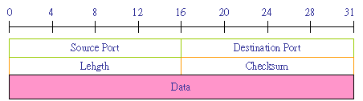

# TCP/IP協定
```
##網際網路協議（英語：Internet Protocol Suite，縮寫IPS）
是一個網路通訊模型，以及一整個網路傳輸協定家族，為網際網路的基礎通訊架構。
它常被通稱為TCP/IP協定套組（英語：TCP/IP Protocol Suite，或TCP/IP Protocols），簡稱TCP/IP。
因為該協定家族的兩個核心協定：TCP（傳輸控制協定）和IP（網際網路協定），為該家族中最早通過的標準。
由於在網路通訊協定普遍採用分層的結構，當多個層次的協定共同工作時，
類似電腦科學中的堆疊，因此又被稱為TCP/IP協定疊（英語：TCP/IP Protocol Stack 。
這些協定最早發源於美國國防部（縮寫為DoD）的ARPA網專案，因此也被稱作DoD模型（DoD Model）。
這個協定套組由網際網路工程任務組負責維護。

TCP/IP提供了點對點連結的機制，將資料應該如何封裝、定址、傳輸、路由以及在目的地如何接收，都加以標準化。
它將軟體通訊過程抽象化為四個抽象層，採取協定堆疊的方式，分別實作出不同通訊協定。
協定套組下的各種協定，依其功能不同，被分別歸屬到這四個階層之中，常被視為是簡化的七層OSI模型。
```
```
https://zh.wikipedia.org/wiki/TCP/IP%E5%8D%8F%E8%AE%AE%E6%97%8F
```


# UDP
```
用戶資料包協定（英語：User Datagram Protocol，縮寫：UDP；又稱用戶資料报協定）
是一個簡單的面向資料報的通信協定，位於OSI模型的傳輸層。
該協定由David P. Reed在1980年設計且在RFC 768中被規範。
典型網路上的眾多使用UDP協定的關鍵應用在一定程度上是相似的。

在TCP/IP模型中，UDP為網路層以上和應用層以下提供了一個簡單的介面。
UDP只提供資料的不可靠傳遞，它一旦把應用程式發給網路層的資料傳送出去，
就不保留資料備份（所以UDP有時候也被認為是不可靠的資料報協定）。
UDP在IP資料報的頭部僅僅加入了復用和資料校驗欄位。

UDP適用於不需要或在程式中執行錯誤檢查和糾正的應用，它避免了協定棧中此類處理的開銷。
對時間有較高要求的應用程式通常使用UDP，因為丟棄封包比等待或重傳導致延遲更可取。
```
```
https://zh.wikipedia.org/wiki/%E7%94%A8%E6%88%B7%E6%95%B0%E6%8D%AE%E6%8A%A5%E5%8D%8F%E8%AE%AE
```


# 網際層（Internet Layer）
```
IP（Internet Protocol）：網際通訊協定。
ARP（Address Resolution Protocol）：位址解析協定。
RARP（Reverse Address Resolution Protocol）：反向位址解析協定。
```

# IP
```
網際協定（英語：Internet Protocol，縮寫：IP；也稱網際網路協定）
是用於封包交換資料網路的一種協定。
```

# ARP
```
位址解析協定（英語：Address Resolution Protocol，縮寫：ARP）
是一個通過解析網路層位址來找尋資料鏈路層位址的網路傳輸協定，它在IPv4中極其重要。
ARP最初在1982年的RFC 826（徵求意見稿）中提出並納入網際網路標準 STD 37. ARP 也可能指是在多數作業系統中管理其相關位址的一個行程。
```
```
C:\Users\KSUIE>arp /?

顯示和修改位址解析通訊協定 (ARP) 使用的 IP 對
實際位址轉譯表格。

ARP -s inet_addr eth_addr [if_addr]
ARP -d inet_addr [if_addr]
ARP -a [inet_addr] [-N if_addr] [-v]

  -a            質詢目前的通訊協定資料來顯示目前的
                ARP 項目。如果指定 inet_addr，只會顯示指定電腦的
                IP 及實體位址。如果有多個網路介面使用 ARP，便會顯示每個 ARP
                表格的項目。
  -g            與 -a 相同。
  -v            以詳細資訊模式顯示目前的 ARP 項目。將會顯示
                所有無效項目和回路介面上的項目。
  inet_addr     指定網際網路位址。
  -N if_addr    顯示 if_addr 指定之網路介面的 ARP
                項目。
  -d            刪除 inet_addr 指定的主機。使用萬用字元 * 取代 inet_addr
                可刪除所有主機。
  -s            新增主機並將網際網路位址 inet_addr 與實體位址
                eth_addr 相關聯。實體位址是
                6 個以連字號分隔的十六進位位元組。該項目
                永久不變。
  eth_addr      指定實體位址。
  if_addr       如果存在，這會指定介面的網際網路位址，
                應修改此介面的位址轉譯表格。
                如果不存在，將會使用第一個適用的介面。
範例:
  > arp -s 157.55.85.212   00-aa-00-62-c6-09  .... 新增靜態項目。
  > arp -a                                    .... 顯示 ARP 表格。
```

# RARP
```
逆位址解析協定（Reverse Address Resolution Protocol，RARP）
是一種網路協定，網際網路工程任務組（IETF）在RFC903中描述了RARP。RARP使用與ARP相同的報頭結構，作用與ARP相反。RARP用於將MAC位址轉換為IP位址。
其因為較限於IP位址的運用以及其他的一些缺點，因此漸為更新的BOOTP或DHCP所取代。
```
